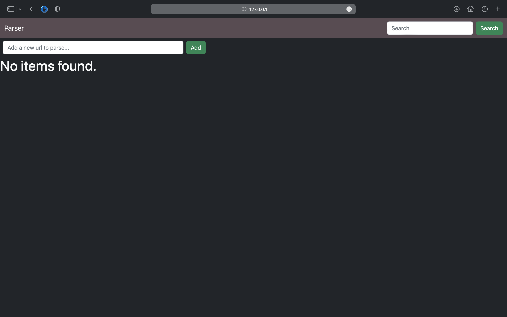
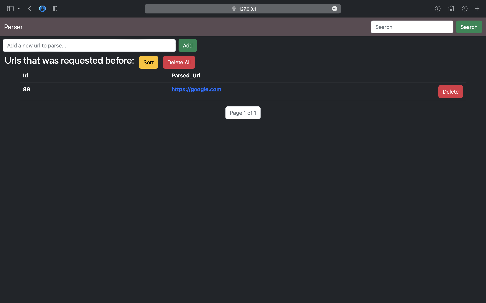
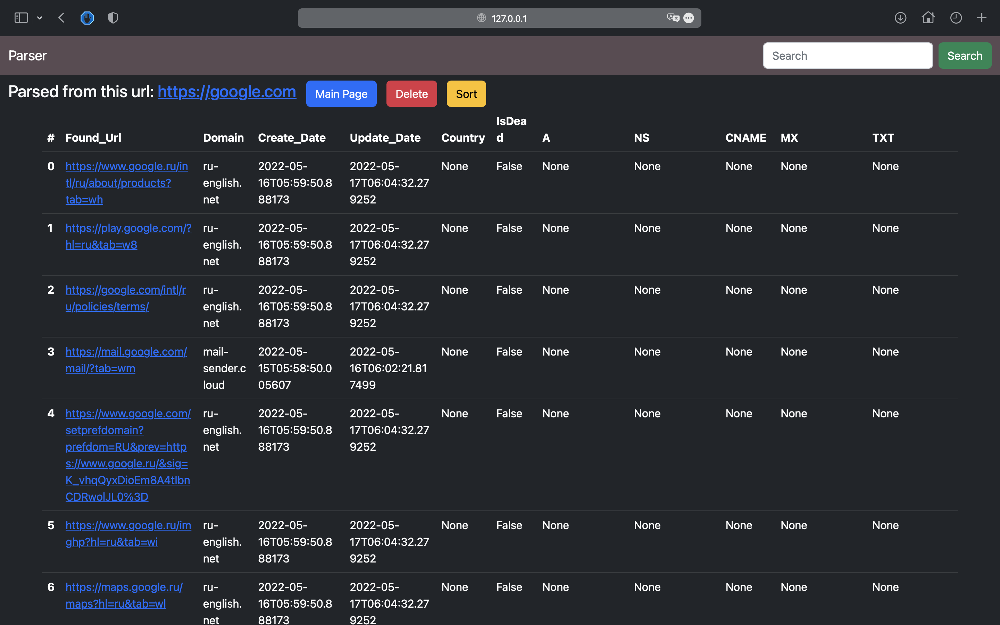
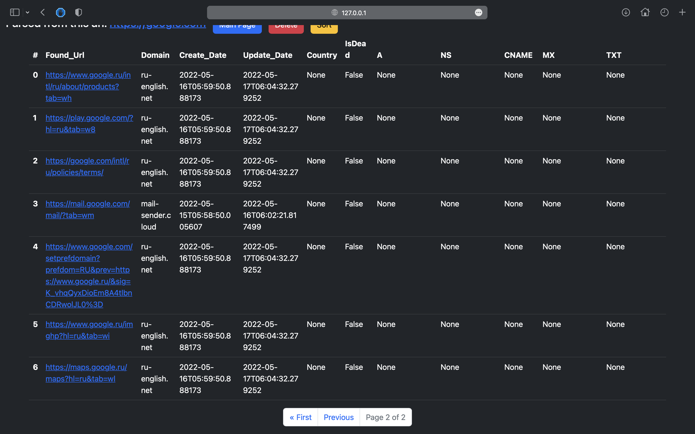
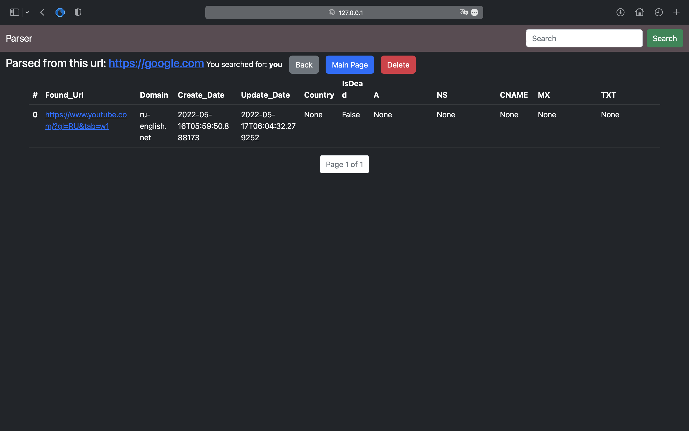

# URL Parser
## Description:

> *This is my test assignment for the company!*

A `Django` back-end service for parsing URL's from href attribute `<a href="#">` with not bad UI made with `Bootstrap 5`. Every parsed URL will be added to the database and all of it's href attributes URL's will be connected to it with `ForeignKey`. I made one-to-many connection in the database because thats much easier to show information about parsed URL in the table.

Also, to every URL from href attribute I added some information from ***https://api.domainsdb.info/v1/domains/search?domain=***`<parsed_url>`. This was asked to do in test assignment.

And finally, I made `multithreaded requestes` for for faster parser operation. Unfortunately, you will have to wait a little until all the href attributes from the site are added to the database and displayed to you.


## Technology stack:
- Language: `Python 3.10.0`
- Web framework: `Django 4.0.4`
- Database: `SQLite3` 
- UI: `Bootstrap 5`

---

## Getting Started:

Install project dependencies:

    pip install -r requirements.txt

After that simply apply the migrations:

    python manage.py migrate --run-syncdb
    

You can now run the development server:

    python manage.py runserver

## What you can do:

    /add/?url=<url_to_parse> 

- Request method: GET

This will parse url that you gave and after adding it to the database show you all it's href attributes in the table.


```
/delete/<int:url_id>/
```
- Request method: GET

This will delete url that was parsed before by it's id.

```
/delete_all_urls/
```
- Request method: GET

This will delete all urls that was parsed before.

```
/show_url/<int:url_id>/
```
- Request method: GET

This will show you parsed url by it's id.

---

## Some screenshots of the project:


-

-

-

-
